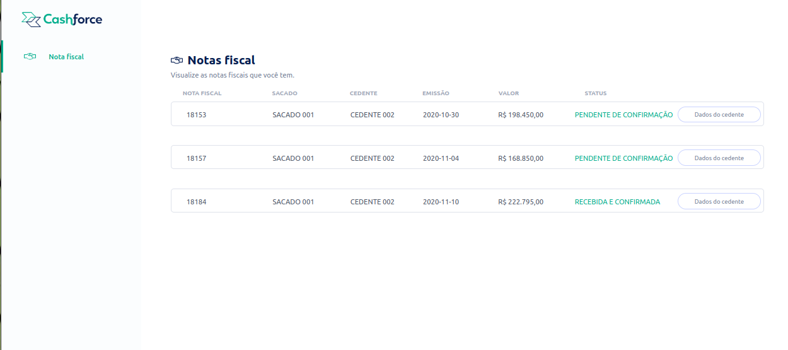
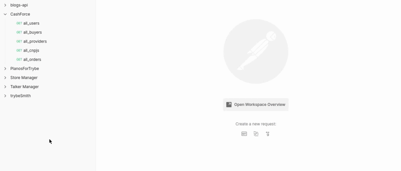

<div align="center"> 
    
</div>

<br>
<br>
<br>


<div align="center"> 
    
</div>

<br>
<br>

# Sumario
   - [Sobre](#sobre)
   - [Tecnologias](#tecnologias-utilizadas)
   - [Habilidades](#habilidades-desenvolvidas)
   - [Instruções](#instruções)
#

# Sobre

###  O projeto contém duas partes, uma contendo o back-end, na qual foram desenvolvidas 5 rotas, para retornar dados, foi implementado com arquitetura MSC(models, services, e controllers), utilizando sequelize para realizar a comunicação com o banco de dados e o relacionamento entre tabelas. Já na parte front-end foi desenvolvida em ReactJs contento a tela de um sistema de gestão empresarial. 

#

# Tecnologias utilizadas
- [Postman](https://www.postman.com/)
- [MySQL Workbench](https://www.mysql.com/products/workbench/)
- [Node.js](https://nodejs.org/en/about/)
- [express](https://expressjs.com/pt-br/)
- [SQL](https://www.w3schools.com/sql/)
- [Sequelize](https://sequelize.org/)
- [ReactJs](https://reactjs.com/)
- [TailWind](https://tailwindcss.com/docs/installation)
#

# Habilidades desenvolvidas
- Criar e associar tabelas usando models do sequelize
- Construir endpoints para consumir os models que criar
- Construir components em React 
- Consumir API construida
- Usar ORM com pacote sequelize do npm

#

# Instruções

```bash
    # Clonar repositório

    $ git clone https://github.com/furquin/smith

    # Entrar no diretório de back-end

    $ cd Back-end

    # Instalar dependências

    $ npm install

    # Iniciar a aplicação com nodemon

    $ npm run debug

    # Entrar no diretório de front-end

    $ cd Front-end

    # Instalar dependências

    $ npm install

    # Iniciar a aplicação com nodemon

    $ npm start

```

<br>
<br>
<br>

### Desenvolvido por [Laert Furquin](https://github.com/furquin) 

